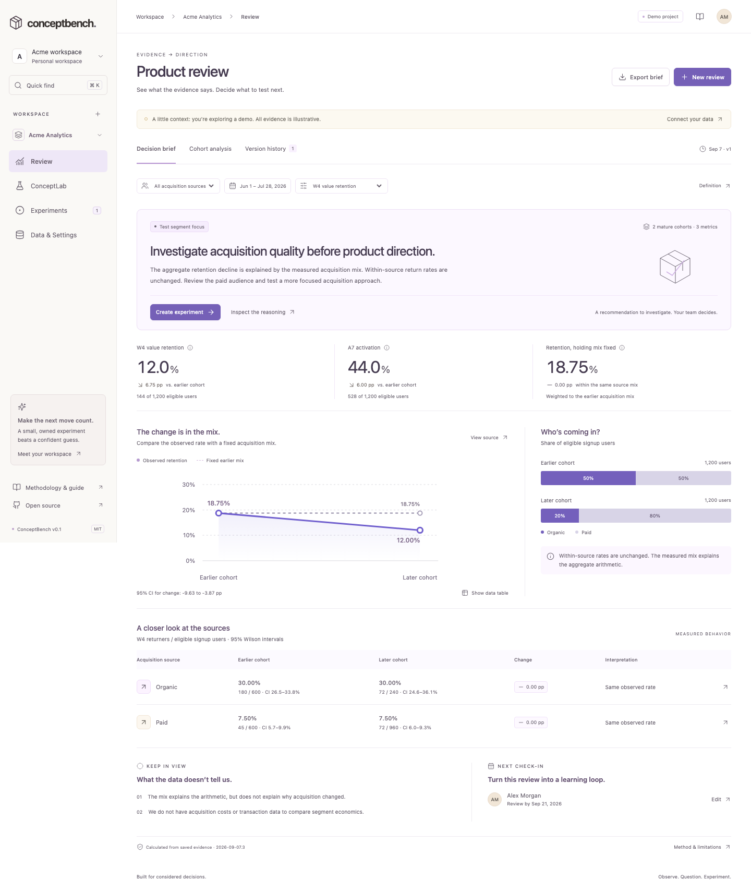

# ConceptBench

[](https://github.com/hitrich/conceptbench/actions/workflows/checks.yml)
[](LICENSE)

An open-source product research workspace for deciding what to improve, which audience to focus on, and what to test next.

Bring behavioral aggregates, human feedback, and experiment outcomes into a versioned **Decision Brief**. Inspect the source behind every calculated claim. Own the next experiment. Synthetic concept comparisons are clearly marked experimental and never establish demand or trigger a pivot recommendation.



## Run locally

Requires Docker Compose and Python 3 for generating deployment keys. No provider credentials are needed for the demo.

```sh
git clone https://github.com/hitrich/conceptbench.git
cd conceptbench
./scripts/setup.sh
docker compose up --build -d
```

Open **http://localhost:8008**. The first visit creates a private demonstration workspace with fabricated cohorts and three example concept studies. Changes persist in PostgreSQL. Sign out through the account menu and create an account for your own project. Local Compose binds only to the loopback interface.

```sh
docker compose ps
docker compose logs --tail=50 web worker
docker compose down   # stops services; keeps data volumes
```

## What works

| Surface | Capabilities |
| --- | --- |
| Review | Frozen event definitions, UTC maturity checks, Wilson/Newcombe intervals, fixed-mix comparison, source inspection, explicit evidence selection, immutable brief versions, private Markdown/JSON exports |
| ConceptLab | Independent 3–5-concept studies, grouped development/held-out splits, reviewed human CSV imports, distributions, bounded synthetic runs, cancellation and partial results |
| Experiments | Owned hypotheses, metrics, guardrails, stopping rules, review dates, recorded outcomes and reusable evidence |
| Data & Settings | Product context, reviewed aggregate CSV, PostHog cloud Endpoints adapter, encrypted credentials, roles, retention, deletion and per-run budgets |

The demo reproduces **225/1,200 = 18.75%** earlier retention and **144/1,200 = 12%** later retention. Organic retention stays at 30%; paid stays at 7.5%. Holding the earlier acquisition mix fixed gives **18.75%**, so the brief recommends investigating acquisition quality before product direction. This is fabricated arithmetic, not evidence about a real product.

## Status and limits

This is a **self-hosted pilot**, not a completed customer validation study. The credential-free CSV and demo journeys are exercised in browser tests. The PostHog adapter follows the documented Endpoints contract and has fixture/failure tests; live tenant reconciliation, hosted OAuth and assisted endpoint installation remain release gates. Synthetic inference has mocked-provider and numerical tests; it has not been validated against an independent SaaS human benchmark. No live provider calls or customer studies are bundled as evidence.

Supported measurement is identified-user signup cohorts, weekly recurring value, A7 activation and W4 retention. Account-level metrics, automatic daily refresh, provider experiment execution, organization SSO and public report sharing are outside this pilot. [Detailed scope and acceptance gates](docs/BUILD.md).

## Develop and verify

Python 3.11/3.12, Node 22+, and npm:

```sh
python3 -m venv .venv
.venv/bin/pip install -r requirements.txt
npm --prefix frontend ci
npm --prefix frontend run build
.venv/bin/python backend/manage.py migrate
.venv/bin/python backend/manage.py collectstatic --noinput
.venv/bin/python backend/manage.py runserver 127.0.0.1:8000
```

In separate terminals, run `npm --prefix frontend run dev` for Vite at http://127.0.0.1:5173 and `.venv/bin/python backend/manage.py worker` for queued work and retention cleanup. Development uses an ignored SQLite database in `private/`; Compose uses PostgreSQL. Django reads process environment variables; Compose loads `.env` for you.

```sh
.venv/bin/python backend/manage.py test core
.venv/bin/python backend/manage.py makemigrations --check --dry-run
npm --prefix frontend exec -- playwright install chromium
npm --prefix frontend run test:e2e  # requires the Vite and Django dev servers
```

For the production image, run `docker compose exec -T web python backend/manage.py test core` and `E2E_BASE_URL=http://127.0.0.1:8008 npm --prefix frontend run test:e2e`. Browser tests create fabricated workspaces on the target installation; use a development or test instance.

## Documentation

- [Self-hosting, backup/restore and key rotation](docs/SELF_HOSTING.md)
- [Metric definitions, decision rules and reproducible evaluation](docs/METHODOLOGY.md)
- [PostHog and CSV connector contract](docs/CONNECTOR.md)
- [Experimental model configuration and budgets](docs/SYNTHETIC.md)
- [API contract](docs/openapi.json) and [contributing](CONTRIBUTING.md)
- [Security and data handling](SECURITY.md)

ConceptBench code is **MIT licensed**. The vendored SSR numerical kernel has its own [Apache 2.0 license and provenance](backend/core/vendor/ssr/NOTICE.md). All example data is fabricated.
